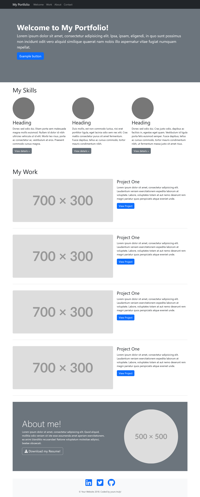

# BOOTSTRAP PORTFOLIO

## Description

Revamping former portfolio which can be found here: https://reginaabena19.github.io/EDX-WEEK-2/ 

## Task
The aim of week 3's challenge is to recreate week 2's portfolio challenge using bootstrap. 

## Credits
https://fontawesome.com/icons - For use of icons

## Workflow 
This time round I committed straight to main with very clear commit messages and history  

## Installation
The challenge is deployed using Github Pages. The end result can be found here: https://reginaabena19.github.io/EDX-WEEK-3/
When viewing through the editor ensure live server is installed in order to run the index.html file in the browswer. 

## License 
MIT

